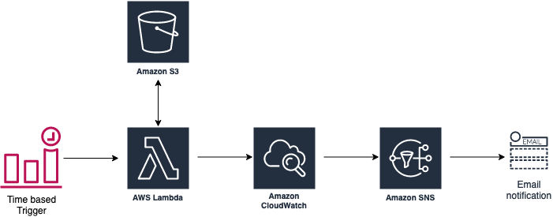

# S3 Object Freshness Checker

S3 Object Freshness Checker is a solution that monitors object freshness in a given S3 bucket and alerts if objects haven't been delivered beyond a specified time. Alerts are delivered via Email.  The supplied AWS CloudFormation template creates an AWS Lambda function, an Amazon CloudWatch Alert, and an Amazon SNS topic. A diagram of the deployable architecture is displayed below.

## Architecture

## Deployment

### Console
1. Download or clone this repository to your computer.

2. Login to the AWS Console of the account containing the S3 bucket to be monitored

3. Navigate to the AWS CloudFormation Service

4. Click **Create Stack**.

5. Select *Template is ready* and *Upload a template file*. Then, select *Chose File* and select the `S3ObjectFreshnessChecker.yaml` file downloaded in Step 1, and click **Next**.

6. Enter the following details and click **Next**:

  **Stack Name**: Name of the AWS CloudFormation Stack

  **Bucket**: Name of Amazon S3 bucket to monitor  (*Note: This bucket should already exist*)

  **EmailAddress**: Email address to send alerts to

  **Path**: Object key prefix for objects to be checked.

7. Optionally, specify tags and click **Next**

8. Check the box to acknowledge that this AWS Cloudformation template creates IAM resources and click **Create Stack**

9.  Wait for the new AWS CloudFormation stack status to transition to *Create Complete*.  

10. After the AWS CloudFormation stack is created, an email will be sent to the email address specified in Step 6 asking to confirm the subscription to the AWS SNS Topic. Click the link in the email to confirm the topic subscription.
